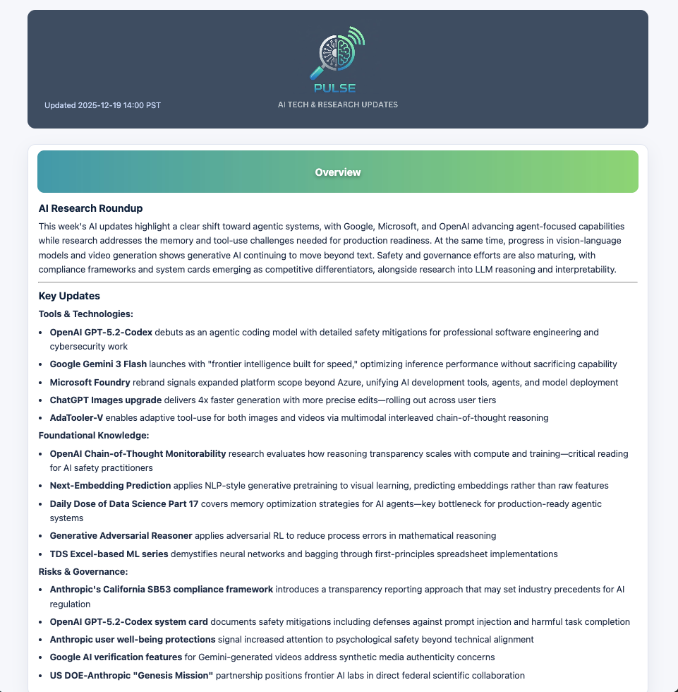

# AI Researcher Agent

MCP tool for LangChain-based AI research. It aggregates pulse and targeted searches across Web, ArXiv, and configured scrapers, and can render Markdown or HTML reports.

## Example Report


## Prerequisites
- Python 3.12+
- `uv` for dependency management (`pip install uv`)
- Env vars:
  - `FOUNDRY_API_KEY`
  - `FOUNDRY_ENDPOINT`
  - `FOUNDRY_DEPLOYMENT`
  - `SERPAPI_API_KEY` (for web search; optional but recommended)

## Install / Sync deps
```bash
uv sync
```

## Configuration (`config.yaml`)
- `tools`: Topics and per-source scraper settings.
- `days_back`: Default recency window.
- `banners`: Optional mapping of source name → banner image URL/path. If not set, the formatter looks for `assets/banners/<source>.jpg`.
- `llm`: Model + temperature.

## Running
- MCP server: `uv run python -m src.main`
- Pulse report: `make pulse` → writes HTML, Markdown, and JSON into `output/generated_at_YYYYMMDD_HHMMSS/` (Pacific time). Banners are copied into the subfolder for relative paths.
- Regenerate from saved JSON: `make regen SUBDIR=generated_at_YYYYMMDD_HHMMSS`

## HTML vs Markdown output
- `output_format="markdown"` (default): Markdown string with summaries and source sections.
- `output_format="html"`: Styled HTML with banners, collapsible source cards, per-source summaries, and post lists. Save to a file to view in a browser (example):
```python
from src.agent import ResearcherAgent
html = ResearcherAgent().pulse_search(output_format="html")
with open("pulse_report.html", "w") as f:
    f.write(html)
```

## Customizing banners
- Header banner: `assets/banners/header.jpg`
- Overview banner: `assets/banners/overview.jpg`
- Source banners: place images in `assets/banners/` named `<source>.jpg` (e.g., `arxiv.jpg`, `web_search.jpg`, or scraper key names), or set explicit URLs/paths under `banners` in `config.yaml` keyed by the source name.

## Adding or updating sources
1) For a new scraper, add an entry under `tools.webscrapers` in `config.yaml` with selectors and base URL.  
2) For new topics, extend the `topics` arrays for existing tools.  
3) Restart the MCP server or rerun the pulse command to pick up changes.

## Testing
```bash
make tests
```

## Targeted search (programmatic)
```python
from src.agent import ResearcherAgent
agent = ResearcherAgent()
result = agent.targeted_search("my query", tools=["arxiv", "web_search"])
print(result)
```

## MCP usage
Point your MCP-compatible client (e.g., Claude Desktop) to the running server. Tools:
- `pulse_research()`
- `targeted_research(query, tools=None)` (tools is a comma-separated string)

## Project layout
```
ai-researcher-agent/
├─ src/
│  ├─ agent.py            # Core agent logic, LLM summarization, orchestration
│  ├─ html_formatter.py   # HTML page rendering (banners, collapsible cards, styling)
│  ├─ pulse.py            # CLI for generating/regenerating reports (HTML/MD/JSON)
│  ├─ main.py             # MCP server entrypoint
│  └─ tools/
│     ├─ base_tool.py     # Common tool interface/helpers
│     ├─ web_search.py    # Web search integration (SerpAPI)
│     ├─ arxiv_tool.py    # ArXiv search
│     └─ webscraper_tool.py # Generic HTML/RSS scraping
├─ assets/
│  └─ banners/            # Header/overview/source banner images
├─ output/
│  └─ generated_at_*      # Generated report folders (HTML, MD, JSON, copied assets)
├─ tests/
│  └─ test_html_formatter.py # Formatter tests
├─ config.yaml            # Topics, scraper configs, banners, LLM settings
├─ Makefile               # `make pulse`, `make regen`, `make tests`
└─ README.md
```

## Architecture & flow
```
[User / CLI / MCP client]
        |
        v
   src/pulse.py  (CLI)
      - generates live data via src.agent
      - or regenerates from saved JSON
        |
        v
   src/agent.py
      - loads config.yaml (topics, tools, banners)
      - calls tools for data (web_search, arxiv, scrapers)
      - per-source LLM summaries
      - overview summary (cross-source)
        |
        v
   src/html_formatter.py
      - renders HTML (banners, collapsible cards)
      - shared styling for inline code, lists, headers
        |
        v
   output/generated_at_*/ (HTML, Markdown, JSON, assets)

MCP path:
[MCP client] -> src/main.py (FastMCP) -> src.agent (pulse_research, targeted_research)

Tools:
- src/tools/web_search.py (SerpAPI)
- src/tools/arxiv_tool.py
- src/tools/webscraper_tool.py (HTML/RSS scraping)
```

## License
Apache 2.0
